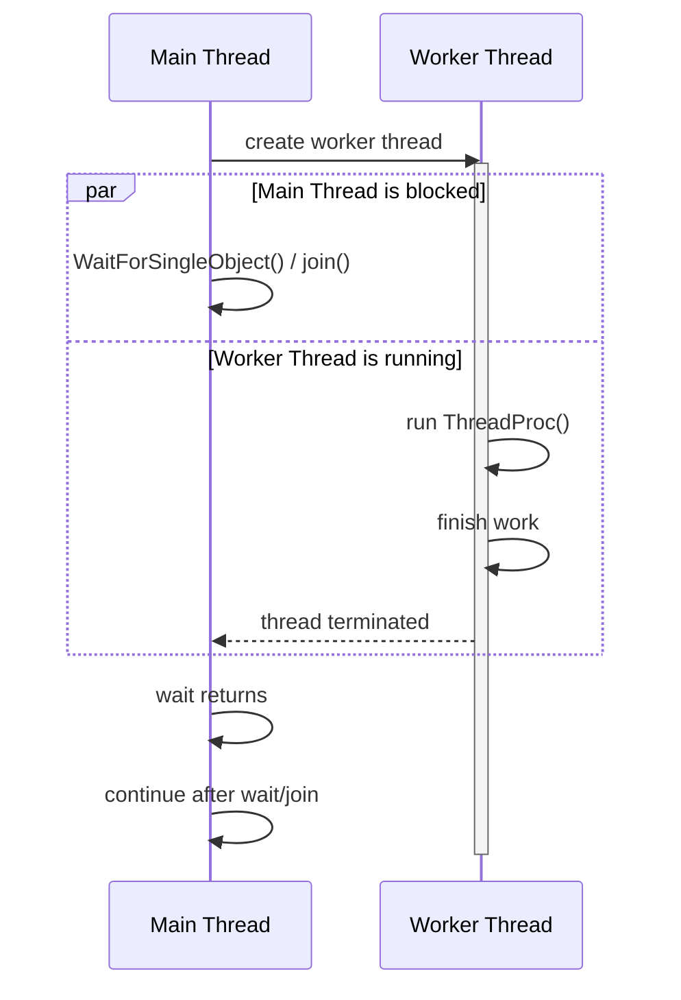

01_ThreadLifeCycle
======================

### 1. 목표

스레드를 생성하고, 워커 스레드가 끝날 때까지 기다린 뒤, 사용한 리소스를 정리하는 기본 흐름을 비교합니다.

이 프로젝트에서는 같은 동작을 세 가지 방식으로 확인합니다.

- WinAPI 버전: `CreateThread`
- CRT 버전: `_beginthreadex`
- Std 버전: `std::thread`

각 워커 스레드는 자신의 thread id를 출력하고, 잠시 대기한 뒤 종료됩니다.
메인 스레드는 생성한 워커 스레드가 끝날 때까지 기다립니다.


---

### 2. 개념 정리

#### 프로세스와 스레드

프로세스는 운영체제 관점에서 특정 프로그램의 실행 단위입니다.
각 프로세스는 독립적인 가상 주소 공간을 가지며, 운영체제에 의해 물리 메모리에 매핑되어 실행됩니다.

하나의 프로세스는 여러 개의 스레드를 가질 수 있습니다.
스레드는 프로세스 내부에서 실제 CPU 명령어를 실행하는 흐름의 단위입니다.

```text
프로세스
├─ 코드(.text)                 공유
├─ 전역/정적 데이터(.data)      공유
├─ 힙(heap)                    공유
└─ 스레드들
   ├─ 스택(Stack)              스레드 전용
   ├─ CPU 레지스터              스레드 전용
   └─ TLS(Thread Local Storage) 스레드 전용
```

스레드들은 같은 프로세스 안의 코드, 전역/정적 데이터, 힙을 공유합니다.
반면 함수 호출 스택, CPU 레지스터, TLS처럼 실행 흐름에 필요한 상태는 스레드마다 따로 가집니다.

#### CreateThread

`CreateThread`는 Windows 운영체제가 제공하는 스레드 생성 API입니다.

```cpp
HANDLE hThread = ::CreateThread(...);
::WaitForSingleObject(hThread, INFINITE);
::CloseHandle(hThread);
```

- `CreateThread`: 새 스레드 생성
- `WaitForSingleObject`: 워커 스레드 종료까지 대기
- `CloseHandle`: 스레드 핸들 정리

주의할 점은 `CreateThread`가 C/C++ 런타임(CRT)의 스레드별 데이터를 초기화하지 않는다는 것입니다.
스레드 함수 안에서 CRT나 C++ 표준 라이브러리를 사용한다면 `_beginthreadex` 또는 `std::thread`를 사용하는 편이 안전합니다.

#### _beginthreadex

`_beginthreadex`는 C 런타임이 제공하는 스레드 생성 함수입니다.
WinAPI 스레드 핸들을 얻을 수 있으면서도 CRT가 필요한 스레드별 초기화를 수행합니다.

```cpp
uintptr_t hThreadRaw = _beginthreadex(...);
HANDLE hThread = reinterpret_cast<HANDLE>(hThreadRaw);
::WaitForSingleObject(hThread, INFINITE);
::CloseHandle(hThread);
```

`_beginthreadex`가 반환한 값은 Windows `HANDLE`로 변환해서 `WaitForSingleObject`와 `CloseHandle`에 사용할 수 있습니다.

#### std::thread

`std::thread`는 C++ 표준 라이브러리의 스레드 클래스입니다.

```cpp
std::thread worker(&ThreadProc);
worker.join();
```

- `std::thread`: 워커 스레드 생성
- `join`: 워커 스레드 종료까지 대기

`std::thread` 객체가 `join()` 또는 `detach()`되지 않은 상태로 소멸하면 프로그램이 종료될 수 있습니다.
따라서 생성한 스레드는 반드시 생명주기를 명확히 정리해야 합니다.

---

### 3. 실행 방법 / 결과

현재 `01_ThreadLifeCycle.cpp`의 `main()`은 `WMain()`을 호출합니다.

```cpp
int main()
{
    WMain();
    return 0;
}
```

따라서 기본 실행은 WinAPI `CreateThread` 버전과 CRT `_beginthreadex` 버전을 순서대로 보여줍니다.

Std 버전을 실행하려면 `01_ThreadLifeCycle.cpp`에서 `WMain()` 대신 `SMain()`을 호출하면 됩니다.

```cpp
int main()
{
    SMain();
    return 0;
}
```

실행 결과에서는 메인 스레드와 워커 스레드의 thread id가 서로 다르게 출력되는지, 그리고 메인 스레드가 워커 종료를 기다린 뒤 종료되는지 확인합니다.

---

### 4. 핵심 정리

- 스레드는 프로세스의 메모리를 공유하지만, 스택과 레지스터 같은 실행 상태는 따로 가집니다.
- 스레드를 생성한 뒤에는 종료 대기와 핸들 정리가 필요합니다.
- WinAPI에서는 `WaitForSingleObject`로 스레드 종료를 기다립니다.
- `std::thread`에서는 `join()`으로 스레드 종료를 기다립니다.
- C/C++ 런타임을 사용하는 스레드에는 `CreateThread`보다 `_beginthreadex` 또는 `std::thread`가 더 적합합니다.
