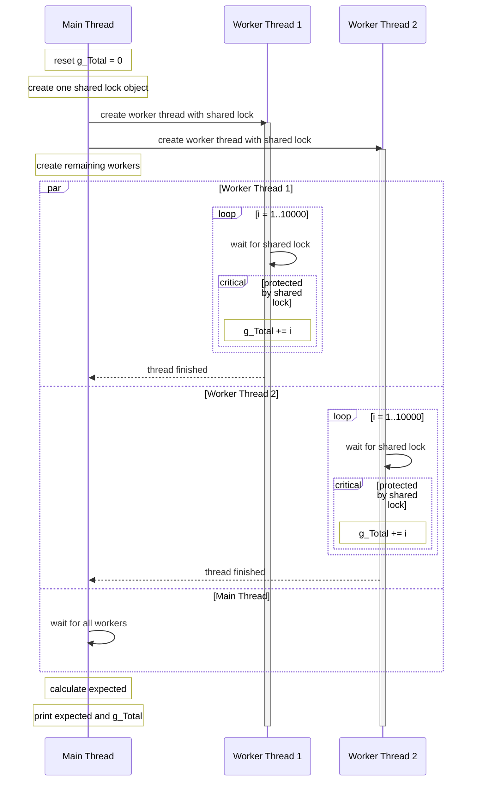

02_MutualExclusion
======================

### 1. 목표

여러 스레드가 하나의 공유 데이터에 동시에 접근할 때 왜 **상호배제(Mutual Exclusion)** 가 필요한지 확인합니다.

이 프로젝트에서는 전역 변수 `g_Total`을 여러 워커 스레드가 동시에 증가시킵니다.

- 공유 데이터: `g_Total`
- 스레드 개수: `10000`
- 각 스레드가 하는 일: `1`부터 `10000`까지 `g_Total`에 더하기
- 기대 결과: 스레드 하나의 합을 `10000`개 스레드가 모두 더한 값

모든 스레드가 올바르게 실행되면 `expected`와 `g_Total`이 같아야 합니다.



위 다이어그램에서는 워커 스레드를 2개만 표시했지만, 실제 코드는 같은 패턴의 워커를 `10000`개 생성합니다.
시퀀스의 생명선은 실행 흐름을 가진 스레드만 두고, `mutex` / `CRITICAL_SECTION`은 `shared lock`이라는 진입 규칙으로 표시했습니다.
핵심은 여러 워커가 동시에 실행되더라도 `g_Total`을 읽고 수정하고 쓰는 구간은 락을 잡은 스레드 하나만 통과한다는 점입니다.

---

### 2. 개념 정리

#### 데이터 레이스

`g_Total += i`는 한 줄로 보이지만 CPU 관점에서는 보통 여러 단계로 나뉩니다.

1. `g_Total` 값을 메모리에서 읽기
2. 읽은 값에 `i` 더하기
3. 결과를 다시 `g_Total`에 쓰기

예를 들어 x64 환경에서는 컴파일러/최적화 옵션에 따라 다르지만, 개념적으로 아래처럼 나뉠 수 있습니다.

```asm
; 예시: g_Total 전역 변수의 메모리 주소가 0x00007FF6_12345000 이라고 가정

; 1. g_Total 값을 메모리에서 읽기
mov     rax, qword ptr [0x00007FF6_12345000]

; 2. 읽은 값에 i 더하기
add     rax, rcx

; 3. 결과를 다시 g_Total에 쓰기
mov     qword ptr [0x00007FF6_12345000], rax
```

여기서 `rcx`는 예시로 든 `i` 값이라고 보면 됩니다.
`0x00007FF6_12345000`은 설명을 위한 가상의 주소이며, 실제 `g_Total`의 주소는 실행 파일이 로드되는 위치나 ASLR(Address Space Layout Randomization)에 따라 실행할 때마다 달라질 수 있습니다.

중요한 점은 `read -> add -> write`가 하나의 쪼개지지 않는 작업이 아니라는 것입니다.
여러 스레드가 이 작업을 동시에 수행하면 서로의 중간 결과를 덮어써서 일부 더하기가 사라질 수 있습니다.

예를 들어 두 스레드가 동시에 `g_Total`이 `10`인 상태를 읽고 각각 `+1`, `+2`를 수행하면,
정상 결과는 `13`이어야 하지만 마지막에 쓴 값만 남아서 `11` 또는 `12`가 될 수 있습니다.

이런 문제를 **데이터 레이스(data race)** 라고 합니다.

#### 임계 구역과 상호배제

공유 데이터를 읽고/수정하고/쓰는 구간을 **임계 구역(Critical Section)** 이라고 합니다.

```cpp
g_Total += i;
```

상호배제는 여러 스레드 중 한 순간에 하나의 스레드만 임계 구역에 들어가게 하는 규칙입니다.
임계 구역에 락을 걸면 한 스레드가 `g_Total`을 수정하는 동안 다른 스레드는 기다립니다.

#### Std 버전

Std 버전은 C++ 표준 라이브러리 도구를 사용합니다.

```cpp
std::lock_guard<std::mutex> lock(*args->totalMutex);
g_Total += i;
```

- `std::thread`: 워커 스레드 생성
- `std::mutex`: 공유 데이터 보호용 락
- `std::lock_guard`: scope-based lock

`std::lock_guard`는 생성될 때 mutex를 잠그고, scope를 빠져나갈 때 자동으로 풀어줍니다.

#### WinAPI 버전

WinAPI 버전은 Windows 동기화 도구를 사용합니다.

```cpp
::EnterCriticalSection(args->cs);
g_Total += i;
::LeaveCriticalSection(args->cs);
```

- `_beginthreadex`: CRT 초기화를 포함한 스레드 생성
- `CRITICAL_SECTION`: 같은 프로세스 내부 스레드 간 상호배제
- `EnterCriticalSection`: 임계 구역 진입
- `LeaveCriticalSection`: 임계 구역 탈출

`CRITICAL_SECTION`은 사용 전 `InitializeCriticalSection`으로 초기화하고, 사용 후 `DeleteCriticalSection`으로 정리해야 합니다.

---

### 3. 실행 방법 / 결과

현재 `02_MutualExclusion.cpp`의 `main()`은 `SMain()`을 호출합니다.

```cpp
int main()
{
    SMain();
    return 0;
}
```

따라서 기본 실행은 `std::thread + std::mutex` 버전입니다.
WinAPI 버전을 실행하려면 `SMain()` 대신 `WMain()`을 호출하면 됩니다.

```cpp
int main()
{
    WMain();
    return 0;
}
```

실행하면 아래 두 값이 출력됩니다.

```text
expected=...
g_Total =...
```

- `expected`: 수학적으로 계산한 정답
- `g_Total`: 실제 여러 스레드가 공유 변수에 누적한 결과

상호배제가 올바르게 적용되어 있으면 두 값은 같습니다.
락을 제거하고 실행하면 `g_Total`이 `expected`보다 작거나 매번 달라질 수 있습니다.

---

### 4. 핵심 정리

- 여러 스레드가 같은 데이터를 동시에 수정하면 데이터 레이스가 발생할 수 있습니다.
- `g_Total += i` 같은 한 줄 코드도 실제로는 읽기, 계산, 쓰기 단계로 나뉠 수 있습니다.
- 공유 데이터를 수정하는 구간은 임계 구역으로 보고 보호해야 합니다.
- C++ 표준 방식에서는 `std::mutex`와 `std::lock_guard`를 사용합니다.
- WinAPI 방식에서는 `CRITICAL_SECTION`을 사용할 수 있습니다.
