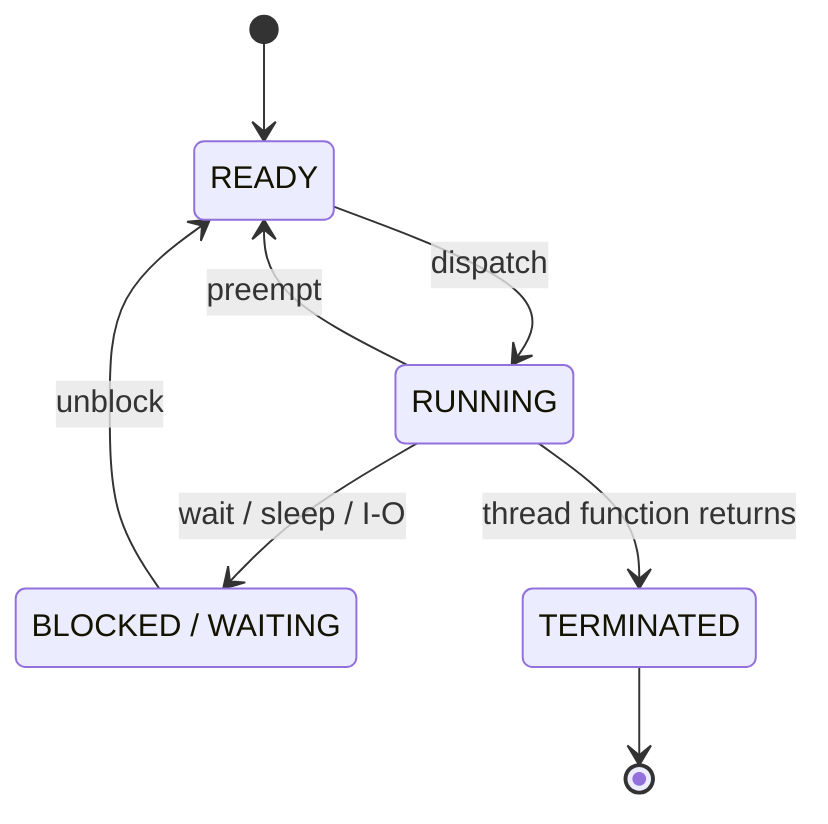

03_SignalWaiting
======================

### 1. 목표

메인 스레드가 워커 스레드를 일시정지, 재개, 종료시키는 방법을 비교합니다.

이 프로젝트에서는 워커 스레드가 1초마다 `Tick` / `Tock`을 번갈아 출력합니다.
메인 스레드는 키 입력을 받아 워커 스레드의 실행 상태를 제어합니다.

- `T`: Pause / Continue 토글
- `Q`: 종료 요청

Std 버전은 `std::condition_variable`을 사용하고, WinAPI 버전은 Event 객체를 사용합니다.

---

### 2. 개념 정리

#### 스케줄러와 문맥 교환

CPU는 한 순간에 하나의 명령어 흐름만 실행하지만, 운영체제는 실행 대상을 아주 빠르게 바꿔가며 여러 스레드가 동시에 실행되는 것처럼 보이게 합니다.
이 역할을 하는 것이 OS의 스케줄러(scheduler)입니다.

운영체제는 하드웨어 타이머 인터럽트로 각 스레드가 CPU를 얼마나 사용했는지 추적합니다.
실행 중인 스레드가 허용된 시간인 퀀텀(Time Quantum)을 모두 사용하거나,
더 높은 우선순위의 스레드가 실행 가능한 상태가 되면 스케줄러가 다음 실행 대상을 다시 고릅니다.

실행 가능한 스레드가 CPU를 아직 받지 못한 상태를 `Ready`라고 합니다.
`Ready` 상태의 스레드는 필요한 조건은 모두 만족했기 때문에 CPU만 배정되면 바로 실행될 수 있습니다.
스케줄러가 그중 하나를 선택해 실제 CPU에서 실행시키면 스레드는 `Ready`에서 `Running`으로 바뀝니다.
이 전환을 **dispatch**라고 합니다.

반대로 `Running` 상태의 스레드가 퀀텀을 다 쓰거나 더 높은 우선순위의 스레드에게 CPU를 넘겨야 하는 상황이 생기면,
실행 중이던 스레드는 CPU를 빼앗기고 다시 `Ready` 상태로 돌아갈 수 있습니다.
이 전환을 **preempt**라고 합니다.

CPU에서 실행할 스레드가 바뀔 때는 현재 스레드의 CPU 레지스터 상태를 저장하고,
다음 스레드의 레지스터 상태를 복원해야 합니다.
이 작업을 **문맥 교환(context switch)** 이라고 합니다.
문맥 교환은 보통 `dispatch`나 `preempt`처럼 CPU의 실행 주체가 바뀌는 시점에 함께 일어납니다.

스레드가 직접 기다리는 상태로 들어가는 경우도 있습니다.
예를 들어 `Sleep`, I/O 대기, `condition_variable::wait`, `WaitForMultipleObjects`처럼 조건이 만족될 때까지 기다리는 API를 호출하면,
그 스레드는 CPU를 계속 붙잡고 있지 않고 `Blocked / Waiting` 상태로 이동합니다.
`Blocked / Waiting` 상태의 스레드는 아직 대기 조건이 풀리지 않았기 때문에, CPU를 배정받아도 바로 실행을 계속할 수 없습니다.
시간이 지나거나 I/O가 완료되거나 동기화 객체가 신호 상태가 되면 대기 조건이 풀리고,
스레드는 다시 `Ready` 상태가 되어 스케줄러의 선택을 기다립니다.

OS가 스케줄링에 개입하는 대표적인 순간은 아래와 같습니다.

- 타이머 인터럽트: 퀀텀 소진
- I/O 인터럽트: 키보드, 마우스, 디스크, 네트워크 작업 완료
- 시스템 콜: 스레드가 OS 기능을 요청할 때
- 동기화 신호: Event, Mutex, Condition Variable 등의 상태 변화

#### 스레드 상태

스레드는 실행 가능 여부와 대기 조건에 따라 상태가 바뀝니다.



- `Running`: 실제 CPU 코어에서 실행 중인 상태
- `Ready`: 실행 조건은 만족했지만 아직 CPU를 받지 못한 상태
- `Blocked / Waiting`: 대기 조건이 풀리지 않아 CPU를 받아도 아직 실행을 계속할 수 없는 상태
- `Terminated`: 스레드 함수가 종료된 상태

이 프로젝트에서 Pause 상태의 워커 스레드는 CPU를 계속 쓰면서 반복 검사하는 것이 아니라,
조건이 바뀔 때까지 대기 상태로 들어가도록 구현합니다.

#### Std 버전

Std 버전은 `std::condition_variable`로 조건 대기를 구현합니다.

```cpp
ctrl->cv.wait(lock, [&] { return ctrl->exitRequested || ctrl->running; });
```

- `std::mutex`: 상태값 보호
- `std::condition_variable`: 조건이 만족될 때까지 대기
- `notify_all`: 대기 중인 워커 스레드를 깨움

워커 스레드는 `running == false`이면 대기하고, 메인 스레드가 `running`을 다시 `true`로 바꾼 뒤 `notify_all()`을 호출하면 깨어납니다.
종료할 때는 `exitRequested = true`로 바꾼 뒤 워커를 깨웁니다.

#### WinAPI 버전

WinAPI 버전은 두 개의 manual-reset Event로 워커 스레드를 제어합니다.

- `runEvent`: signaled이면 실행, non-signaled이면 pause
- `exitEvent`: signaled이면 종료

워커 스레드는 두 Event 중 하나가 신호 상태가 될 때까지 기다립니다.

```cpp
HANDLE waits[2] = { ctrl->exitEvent, ctrl->runEvent };
const DWORD w = ::WaitForMultipleObjects(2, waits, FALSE, INFINITE);
```

메인 스레드는 `T` 입력에 따라 `SetEvent(runEvent)` 또는 `ResetEvent(runEvent)`를 호출하고,
`Q` 입력이 들어오면 `SetEvent(exitEvent)`로 종료를 알립니다.

---

### 3. 실행 방법 / 결과

현재 `03_SignalWaiting.cpp`의 `main()`은 `SMain()`을 호출합니다.

```cpp
int main()
{
    SMain();
    return 0;
}
```

따라서 기본 실행은 `std::thread + std::condition_variable` 버전입니다.
WinAPI 버전을 실행하려면 `SMain()` 대신 `WMain()`을 호출하면 됩니다.

```cpp
int main()
{
    WMain();
    return 0;
}
```

실행하면 워커 스레드가 아래처럼 1초마다 출력합니다.

```text
Tick
Tock
Tick
Tock
```

키 입력에 따른 결과는 아래와 같습니다.

- `T`: 출력이 멈추거나 다시 시작됩니다.
- `Q`: 워커 스레드에 종료를 요청하고 프로그램이 종료됩니다.

---

### 4. 핵심 정리

- 스레드는 `Running`, `Ready`, `Blocked / Waiting` 같은 상태를 오가며 실행됩니다.
- Pause 상태에서는 CPU를 계속 점유하지 말고 조건 대기 상태로 들어가는 편이 좋습니다.
- C++ 표준 방식에서는 `std::condition_variable`로 조건 대기를 구현합니다.
- WinAPI 방식에서는 Event 객체의 signaled / non-signaled 상태로 대기를 제어할 수 있습니다.
- 종료 요청도 하나의 신호로 보고, 워커 스레드가 안전한 지점에서 빠져나오게 설계해야 합니다.
