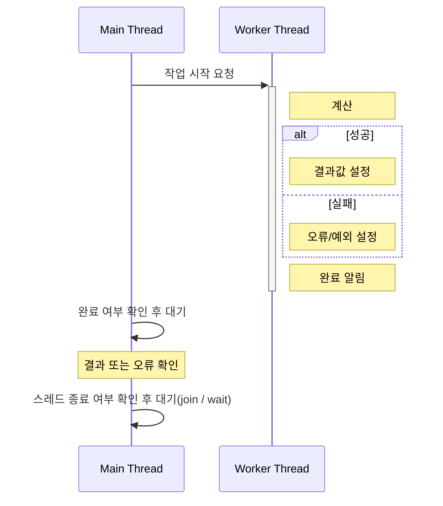

04_ThreadResult
======================

### 1. 목표

워커 스레드가 만든 결과를 메인 스레드에서 **안전하게 수신**하는 방법을 비교합니다.

이 프로젝트에서 워커 스레드가 하는 계산은 아래와 같습니다.

- 입력: 정수 `n`
- 계산: `1`부터 `n`까지의 합
- 결과 타입: `long long`

예를 들어 `n = 5`이면 결과는 `1 + 2 + 3 + 4 + 5 = 15`입니다.

Std 버전은 `std::promise` / `std::future`를 사용하고,
WinAPI 버전은 Event와 공유 상태(shared state)를 직접 구성합니다.



---

### 2. 개념 정리

#### 스레드 결과 전달의 핵심

워커 스레드가 계산한 값을 메인 스레드가 안전하게 읽으려면 두 가지가 필요합니다.

- 결과값을 저장할 위치
- 결과 준비가 끝났음을 알리는 완료 신호

완료 신호 없이 결과값만 공유하면, 메인 스레드가 아직 준비되지 않은 값을 읽을 수 있습니다.
반대로 완료 신호를 기다린 뒤 결과를 읽으면 워커가 값을 다 쓴 뒤에 접근하는 규칙을 만들 수 있습니다.

#### Std 버전

Std 버전은 `std::promise`와 `std::future`를 사용합니다.

- 워커 스레드: 계산 결과를 `promise.set_value(result)`로 저장
- 메인 스레드: `future.get()`으로 완료 대기와 결과 수신을 동시에 수행
- 실패 케이스: 워커가 `promise.set_exception(...)`으로 예외를 전달

```cpp
std::promise<long long> promise;
std::future<long long> future = promise.get_future();

std::thread worker(&PromiseWorker, std::move(promise), n, false);
const long long result = future.get();
worker.join();
```

`std::promise<T>`와 `std::future<T>`는 서로 다른 객체지만, 내부적으로 같은 shared state를 가리키는 핸들입니다.
shared state에는 결과값, 예외, ready 상태, 대기 메커니즘이 들어 있습니다.

`future.get()`은 아래 작업을 한 번에 수행합니다.

- 결과가 아직 준비되지 않았으면 대기
- 결과가 준비되면 값을 반환
- 예외가 저장되어 있으면 그 예외를 다시 throw

#### WinAPI 버전

WinAPI 버전은 결과 저장 공간과 완료 신호를 직접 만듭니다.

```cpp
struct WinResultState
{
    HANDLE doneEvent = nullptr;
    long long value = 0;
    DWORD error = 0;
    int n = 0;
    bool shouldFail = false;
};
```

- 워커 스레드: `value` 또는 `error`를 기록한 뒤 `SetEvent(doneEvent)` 호출
- 메인 스레드: `WaitForSingleObject(doneEvent, INFINITE)`로 완료 신호 대기
- 완료 후: `error == 0`이면 `value` 사용, 아니면 실패 처리

중요한 규칙은 **완료 신호를 기다린 뒤에만 결과 필드를 읽는다**는 것입니다.
`SetEvent`가 결과 기록보다 먼저 호출되거나, 메인 스레드가 Wait 전에 결과를 읽으면 미완성 값을 볼 수 있습니다.

#### Std 방식과 WinAPI 방식의 차이

Std 방식은 완료 대기와 결과 수신이 `future.get()`이라는 하나의 통로로 묶여 있습니다.
그래서 결과를 읽는 시점에 완료 대기가 강제됩니다.

WinAPI 방식은 결과 저장과 완료 알림이 분리되어 있습니다.
따라서 더 유연하지만, 올바른 순서를 사용자가 직접 지켜야 합니다.

---

### 3. 실행 방법 / 결과

현재 `04_ThreadResult.cpp`의 `main()`은 `WMain()`을 호출합니다.

```cpp
int main()
{
    WMain();
    return 0;
}
```

따라서 기본 실행은 WinAPI `Event + shared state` 버전입니다.
Std 버전을 실행하려면 `WMain()` 대신 `SMain()`을 호출하면 됩니다.

```cpp
int main()
{
    SMain();
    return 0;
}
```

WinAPI 버전에서는 워커가 `1`부터 `100000`까지의 합을 계산하고, 완료 Event를 신호 상태로 만든 뒤 메인 스레드가 결과를 읽습니다.

Std 버전은 두 가지 케이스를 연속으로 보여줍니다.

- 성공 케이스: `future.get()`이 계산 결과를 반환
- 실패 케이스: 워커에서 설정한 예외가 `future.get()`에서 다시 throw

---

### 4. 핵심 정리

- 스레드 결과 전달에는 결과 저장 위치와 완료 신호가 모두 필요합니다.
- `std::promise` / `std::future`는 결과 전달, 완료 대기, 예외 전달을 하나의 shared state로 묶어 줍니다.
- WinAPI 방식에서는 Event와 shared state를 직접 구성할 수 있습니다.
- WinAPI 방식은 완료 신호를 기다린 뒤에만 결과를 읽는 규칙을 반드시 지켜야 합니다.
- 결과 저장과 완료 알림의 순서가 바뀌면 미완성 결과를 읽는 버그가 생길 수 있습니다.
